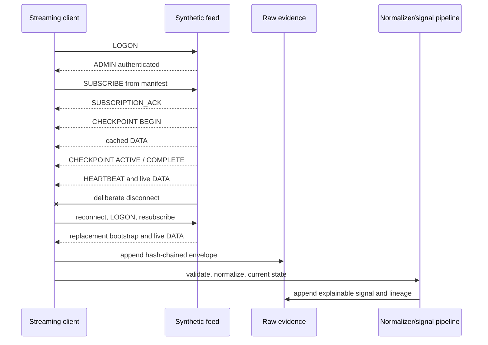

# Synthetic Streaming Signal Platform — GCP Reference

A portfolio-safe Python reference implementation for a resilient, configuration-driven streaming market-data pipeline on Google Cloud.

It demonstrates the engineering patterns needed around a persistent feed: authentication, subscription acknowledgements, cache checkpoints, heartbeats, forced disconnect, reconnect, reauthentication, resubscription, schema validation, immutable evidence, normalized current state, explainable signals, latency p95 and recovery reporting.

> **Important:** this project is not connected to SpiderRock and does not contain its schemas, credentials or market data. The mock protocol is only inspired by common streaming-feed lifecycle concepts. It makes no trading or profitability claims.

## What the demo proves

- One reusable client driven by `configs/subscriptions.json`
- Generic `LOGON`, `ADMIN`, `SUBSCRIBE`, acknowledgement and checkpoint lifecycle
- Deterministic forced disconnect followed by reconnect and resubscription
- Versioned schemas for current-state and append-only families
- SHA-256 hash-chained raw and signal evidence
- Event-time-aware current-state updates
- An explainable synthetic spread-quality signal with source lineage
- Counter metrics and processing/authentication p95
- GCP architecture and Terraform deployment skeleton

## Local architecture



The cloud topology is documented in [docs/architecture.md](docs/architecture.md).

## Run

No third-party Python packages are required.

```bash
export PYTHONPATH=src
python3 -m mlink_gcp.cli \
  --config configs/subscriptions.json \
  --output artifacts/demo
```

Outputs:

- `artifacts/demo/raw_events.jsonl`
- `artifacts/demo/signals.jsonl`
- `artifacts/demo/recovery_report.json`

## Test

```bash
PYTHONPATH=src python3 -m unittest discover -s tests -v
```

The tests verify forced recovery, resubscription, signal generation, schema rejection and tamper detection.

## Container

```bash
docker build -t synthetic-streaming-signal-platform .
docker run --rm synthetic-streaming-signal-platform
```

## Repository map

```text
configs/                 Versioned schema and subscription manifests
src/mlink_gcp/feed.py    Deterministic synthetic feed
src/mlink_gcp/client.py  Connection and recovery state machine
src/mlink_gcp/pipeline.py Validation, normalization and signal lineage
src/mlink_gcp/storage.py Hash-chained append-only evidence
src/mlink_gcp/metrics.py Counters and p95 measurement
infra/terraform/         GCP deployment skeleton
docs/                    Architecture and operations runbooks
tests/                   Recovery, policy and integrity tests
```

## GCP deployment model

The proposed GCP path uses:

- a managed long-running collector with a dedicated runtime identity
- Secret Manager for feed credentials
- Pub/Sub for decoupling and retry/dead-letter handling
- GCS with retention/versioning for immutable raw evidence
- BigQuery for normalized events, current state, signals and lineage
- Cloud Monitoring, structured logs and traces for freshness and p95 alerts

The Terraform is intentionally a reviewed skeleton, not a one-command production promise. Validate feed entitlements, message rates, runtime lifecycle, regions, quotas, retention and cost before deployment.

## Portfolio wording

Safe description:

> Built a synthetic, MLink-style streaming reference platform demonstrating authentication, subscription acknowledgements, cache checkpoints, heartbeats, reconnect/resubscribe, schema governance, immutable evidence and explainable signal lineage on a GCP architecture. It is a protocol simulation, not a production SpiderRock integration.

