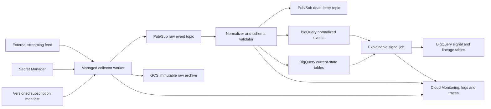

# GCP architecture and decision record

## Context

The reference implementation simulates a narrow streaming market-data protocol. It demonstrates lifecycle and data-governance patterns without using vendor credentials, proprietary schemas, commercial market data, or executing trades.

## Proposed production topology

## Collector placement

The Terraform skeleton uses a Cloud Run Job to demonstrate identity, secrets, image and restart configuration. A continuously connected production feed needs a runtime whose lifecycle supports long-running outbound WebSockets. Choose one of:

1. Cloud Run worker/service if the connection can be safely renewed within platform request/runtime constraints.
2. GKE Autopilot or a managed instance group for an independently supervised long-running worker.
3. A vendor-supported managed connector when available.

Do not treat a request-driven HTTP service as permanently connected without measuring its lifecycle constraints.

## Data contracts

- Every envelope records connection ID, protocol sequence, message family, event time, receipt time, schema version and manifest version.
- Raw records are append-only and land before normalization.
- Current-state tables use message-family primary keys and event-time ordering.
- Event families remain append-only.
- Signals include source record hashes, strategy version and a human-readable explanation.

## Recovery guarantees

The collector detects closure or heartbeat staleness, reconnects with bounded exponential backoff, reauthenticates, replays the versioned manifest, validates acknowledgement and processes the replacement bootstrap checkpoint. Downstream writes must be idempotent by stable event identity.

## Security

- Dedicated runtime service account; no user credentials in containers.
- Feed key in Secret Manager, never Terraform state as plaintext.
- Least-privilege Pub/Sub publish and secret access roles.
- Uniform bucket-level access and retention policy for raw evidence.
- Separate deployment identity from runtime identity.

